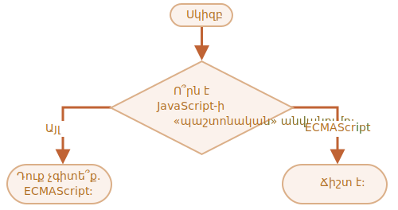

կարևորությունը՝ 2

---

# JavaScript-ի անվանումը

Օգտագործելով `if..else` կառուցվածքը, գրեք կոդ, որը կհարցնի. «Ո՞րն է JavaScript-ի «պաշտոնական» անվանումը:»։

Եթե այցելուն մուտքագրում է «ECMAScript», ապա արտատպեք «Ճիշտ է:», հակառակ դեպքում՝ արտատպեք «Դուք չգիտե՞ք. ECMAScript:»:

[demo src="ifelse_task2"]
