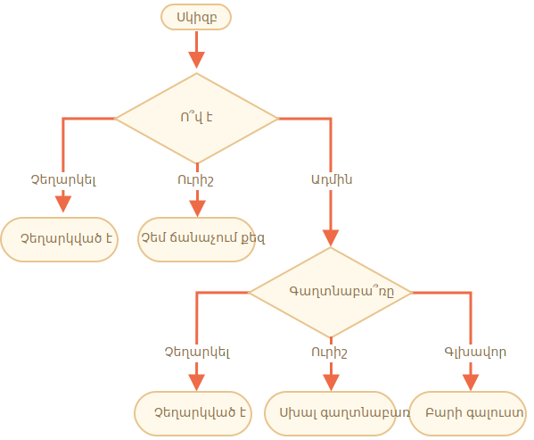

Կարևորություն: 3

---

# Մուտքի ստուգում (login)

Գրեք ծրագիր, որը կպահանջի մուտքի օգտագործելով `prompt`֊ը։

Եթե օգտատերը կմուտքագրի `"Ադմին"`, ապա կբացվի `prompt` գաղտնաբառի համար, եթե ոչինչ չմուտքագրի կամ սեղմի `Esc` ստեղնը  -- կցուցադրվի "Չեղարկված է", եթե մեկ այլ տողային արժեք մուտքագրվի, ապա կցուցադրվի "Չեմ ճանաչում քեզ"։

Գաղտնաբառը ստուգվում է հետևյալ կերպ․

- Եթե այն "Գլխավոր" է, ապա ցուցադրվում է "Բարի գալուստ",
- Ուրիշ տողային արժեքի դեպքում ցուցադրվում է "Սխալ գաղտնաբառ",
- Դատարի տողի և չեղարկված(cancelled) դեպքերում ցուցադրվում է "Չեղարկված է"

Գծապատկերը․

Օգտագործել ներդրված `if` բլոկներ։ Հիշեք նաև ծրագրի ընթեռնելիության մասին։

Հուշում․ prompt֊ին դատարկ տողային արժեք փոխանցելիս այն վերադարձնում է `''`։ `Esc` ստեղնը սեղմելիս prompt֊ի վրա, այն վերադարձնում է `null`։

[demo]
